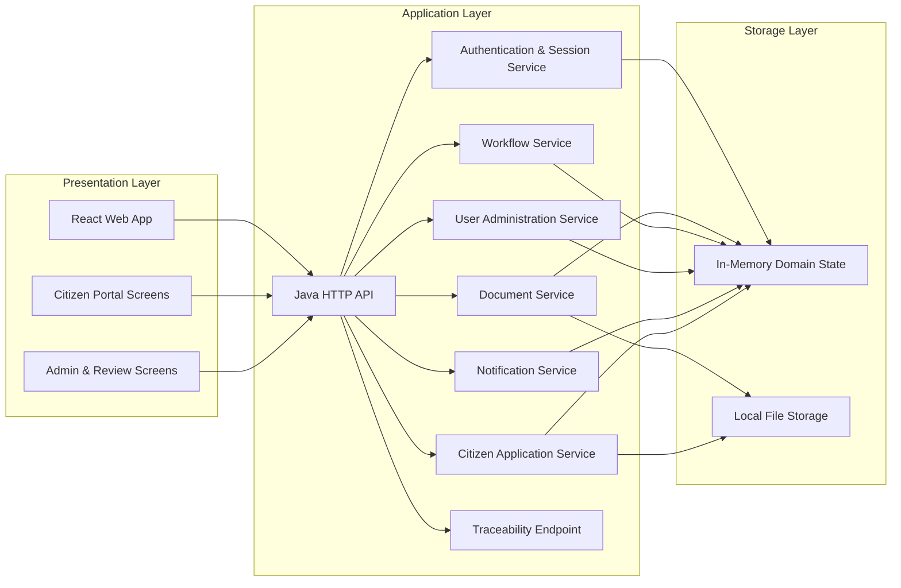

# Component-Based Architecture

## Overview

The system is organised into three layers:

1. Presentation layer: React SPA for staff and citizens.
2. Application layer: Java HTTP API handling authentication, documents, workflows, notifications, and citizen applications.
3. Data and file layer: in-memory operational state with file storage for uploaded document binaries.

## Component Diagram

## Key Design Decisions

- Authentication is token-based with a short demo session timeout to satisfy the inactivity requirement.
- Documents are versioned and protected with role-aware access checks and per-document permissions.
- Duplicate uploads are prevented through checksum comparison before storage.
- Citizen submissions are routed through the same workflow engine as internal approvals.
- File binaries are stored separately from metadata so versions can be tracked cleanly.
