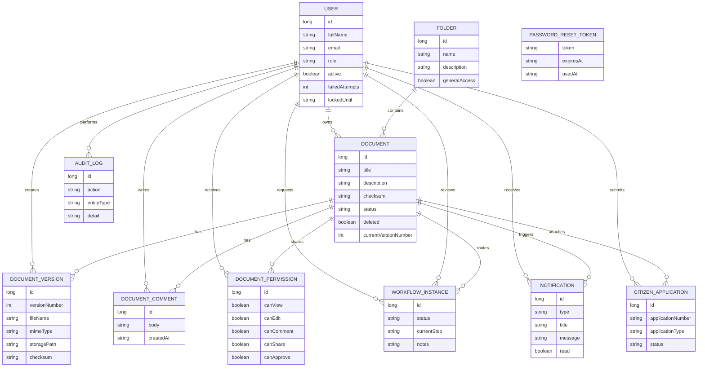
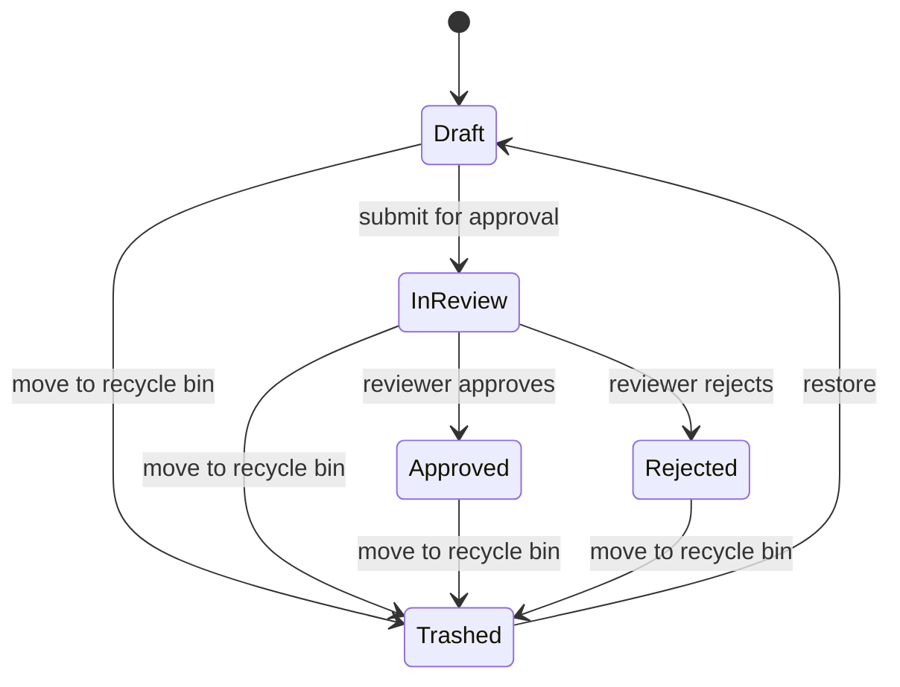

# ERD and State Model

## Entity Relationship Diagram

```mermaid
erDiagram
  USER ||--o{ DOCUMENT : owns
  USER ||--o{ DOCUMENT_VERSION : creates
  USER ||--o{ DOCUMENT_COMMENT : writes
  USER ||--o{ DOCUMENT_PERMISSION : receives
  USER ||--o{ WORKFLOW_INSTANCE : requests
  USER ||--o{ WORKFLOW_INSTANCE : reviews
  USER ||--o{ NOTIFICATION : receives
  USER ||--o{ CITIZEN_APPLICATION : submits
  USER ||--o{ AUDIT_LOG : performs

  FOLDER ||--o{ DOCUMENT : contains
  DOCUMENT ||--o{ DOCUMENT_VERSION : has
  DOCUMENT ||--o{ DOCUMENT_COMMENT : has
  DOCUMENT ||--o{ DOCUMENT_PERMISSION : shares
  DOCUMENT ||--o{ WORKFLOW_INSTANCE : routes
  DOCUMENT ||--o{ NOTIFICATION : triggers
  DOCUMENT ||--o{ CITIZEN_APPLICATION : attaches

  USER {
    long id
    string fullName
    string email
    string role
    boolean active
    int failedAttempts
    string lockedUntil
  }

  FOLDER {
    long id
    string name
    string description
    boolean generalAccess
  }

  DOCUMENT {
    long id
    string title
    string description
    string checksum
    string status
    boolean deleted
    int currentVersionNumber
  }

  DOCUMENT_VERSION {
    long id
    int versionNumber
    string fileName
    string mimeType
    string storagePath
    string checksum
  }

  DOCUMENT_COMMENT {
    long id
    string body
    string createdAt
  }

  DOCUMENT_PERMISSION {
    long id
    boolean canView
    boolean canEdit
    boolean canComment
    boolean canShare
    boolean canApprove
  }

  WORKFLOW_INSTANCE {
    long id
    string status
    string currentStep
    string notes
  }

  NOTIFICATION {
    long id
    string type
    string title
    string message
    boolean read
  }

  CITIZEN_APPLICATION {
    long id
    string applicationNumber
    string applicationType
    string status
  }

  PASSWORD_RESET_TOKEN {
    string token
    string expiresAt
    string usedAt
  }

  AUDIT_LOG {
    long id
    string action
    string entityType
    string detail
  }
```

## Document State Diagram

```mermaid
stateDiagram-v2
  [*] --> Draft
  Draft --> InReview: submit for approval
  InReview --> Approved: reviewer approves
  InReview --> Rejected: reviewer rejects
  Draft --> Trashed: move to recycle bin
  InReview --> Trashed: move to recycle bin
  Approved --> Trashed: move to recycle bin
  Rejected --> Trashed: move to recycle bin
  Trashed --> Draft: restore
```
