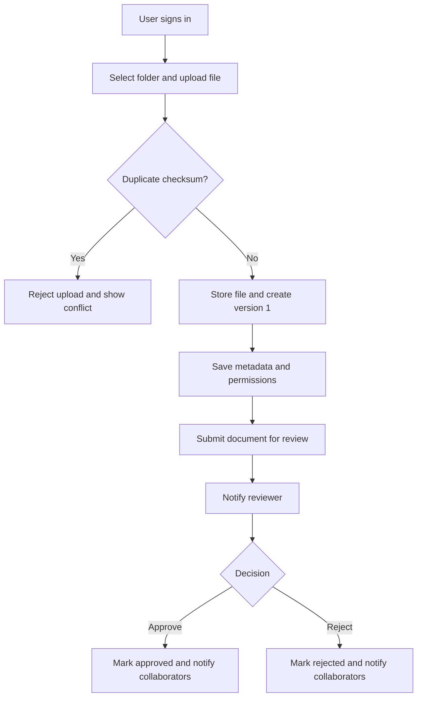
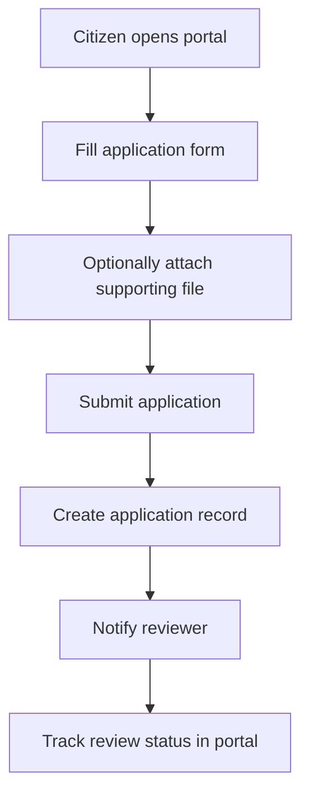
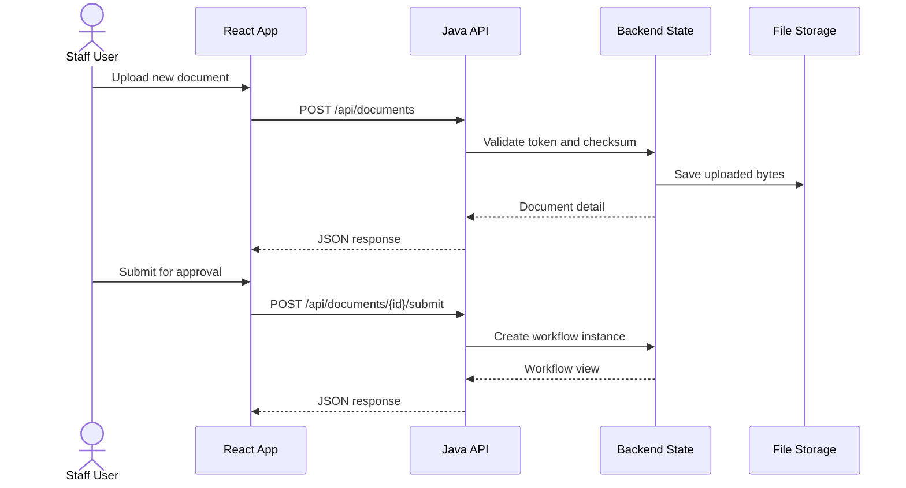

# Flowcharts and Sequence Diagrams

## Upload and Approval Flow

```mermaid
flowchart TD
  A[User signs in] --> B[Select folder and upload file]
  B --> C{Duplicate checksum?}
  C -- Yes --> D[Reject upload and show conflict]
  C -- No --> E[Store file and create version 1]
  E --> F[Save metadata and permissions]
  F --> G[Submit document for review]
  G --> H[Notify reviewer]
  H --> I{Decision}
  I -- Approve --> J[Mark approved and notify collaborators]
  I -- Reject --> K[Mark rejected and notify collaborators]
```

## Citizen Application Flow

```mermaid
flowchart TD
  A[Citizen opens portal] --> B[Fill application form]
  B --> C[Optionally attach supporting file]
  C --> D[Submit application]
  D --> E[Create application record]
  E --> F[Notify reviewer]
  F --> G[Track review status in portal]
```

## Sequence Diagram

```mermaid
sequenceDiagram
  actor Staff as Staff User
  participant UI as React App
  participant API as Java API
  participant Store as Backend State
  participant Files as File Storage

  Staff->>UI: Upload new document
  UI->>API: POST /api/documents
  API->>Store: Validate token and checksum
  Store->>Files: Save uploaded bytes
  Store-->>API: Document detail
  API-->>UI: JSON response
  Staff->>UI: Submit for approval
  UI->>API: POST /api/documents/{id}/submit
  API->>Store: Create workflow instance
  Store-->>API: Workflow view
  API-->>UI: JSON response
```
